


 


 


 


 

<a href="https://github.com/Ashok0517/javascript-assignments"></a>

<a href="https://github.com/Ashok0517/javascript-assignments"></a>

 


<a href="https://www.linkedin.com/in/ashoksingh91"></a>

**Text links:**
[LinkedIn](https://www.linkedin.com/in/ashoksingh91) | [Email](mailto:ashokcyberdev17@gmail.com) | [Instagram](https://www.instagram.com/alpha_code_05) | [GitHub](https://github.com/Ashok0517)

 


