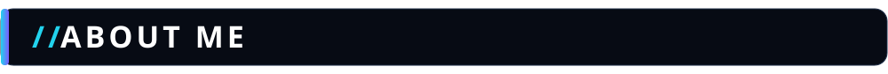
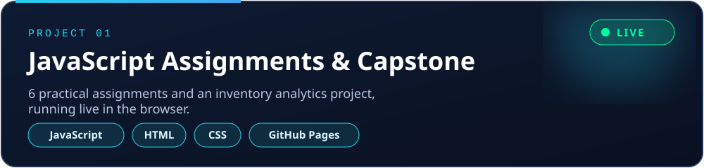

 

 

 

 

 

*Text links:*
[LinkedIn](https://www.linkedin.com/in/ashoksingh91) | [Email](mailto:ashokcyberdev17@gmail.com) | [Instagram](https://www.instagram.com/alpha_code_05) | [GitHub](https://github.com/Ashok0517)

 

